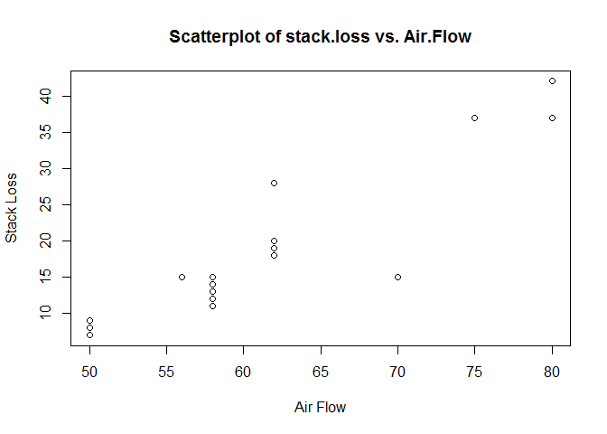

# Introduction

*The summary output shows the Min, 1st Qu, Median, Mean, 3rd Qu, and Max for Air.Flow, Water.Temp, Acid.Conc, Stack.loss

*The str output shows the stackflow dataframe has 21 observations of 4 variables


```r
summary(stackloss)
```

```
##     Air.Flow       Water.Temp     Acid.Conc.      stack.loss   
##  Min.   :50.00   Min.   :17.0   Min.   :72.00   Min.   : 7.00  
##  1st Qu.:56.00   1st Qu.:18.0   1st Qu.:82.00   1st Qu.:11.00  
##  Median :58.00   Median :20.0   Median :87.00   Median :15.00  
##  Mean   :60.43   Mean   :21.1   Mean   :86.29   Mean   :17.52  
##  3rd Qu.:62.00   3rd Qu.:24.0   3rd Qu.:89.00   3rd Qu.:19.00  
##  Max.   :80.00   Max.   :27.0   Max.   :93.00   Max.   :42.00
```

```r
str(stackloss)
```

```
## 'data.frame':	21 obs. of  4 variables:
##  $ Air.Flow  : num  80 80 75 62 62 62 62 62 58 58 ...
##  $ Water.Temp: num  27 27 25 24 22 23 24 24 23 18 ...
##  $ Acid.Conc.: num  89 88 90 87 87 87 93 93 87 80 ...
##  $ stack.loss: num  42 37 37 28 18 18 19 20 15 14 ...
```

# Including Plots

*There is a positive correlation between Air.Flow and stack.loss as when the airflow increases the stackloss increases as well.

<!-- -->

